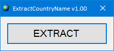

# ExtractCountryName

An application that extracts the names of countries around the world
from [https://www.worldometers.info/geography/alphabetical-list-of-countries/]
to use it as a cSharp enumeration

**Visual**

## License

This project is open source licensed under the [BSD 3-Clause License](https://opensource.org/license/bsd-3-clause/).
Please see the [LICENSE file](/LICENSE.txt) for more information.

## Credits

- This program contains only original work from [GeneticWolf](https://github.com/GeneticWolf).
- Some code snippets from the internet probably inspired me

## License/InternationalId

The copyright owner has the following international identifier :
Iid{80a11b77a52aa9eeed80c9d37dcb7878519289d40beeddb40bb23a60d2711963}
