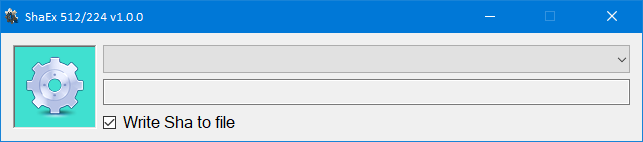

# ExtractCountryName

An application for calculating and storing files Sha512/224 and verify later if the file was modified.

**Visual**

## License

This project is open source licensed under the [BSD 3-Clause License](https://opensource.org/license/bsd-3-clause/).
Please see the [LICENSE file](/LICENSE.txt) for more information.

## Owner International Id

The copyright owner has the following international identifier :
iid{80a11b77a52aa9eeed80c9d37dcb7878519289d40beeddb40bb23a60d2711963}

## Credits

- This program contains only original work from [Sigma3Wolf](https://github.com/Sigma3Wolf).
- Some code snippets from the internet probably inspired me!
- Images are derivative works based on royalty-free files

## Links

- [GitHub](https://github.com/Sigma3Wolf/DesktopApp/)

## Revision

2023-11-03 v1.00 - Initial release Sha512, need to implement Sha512/224
